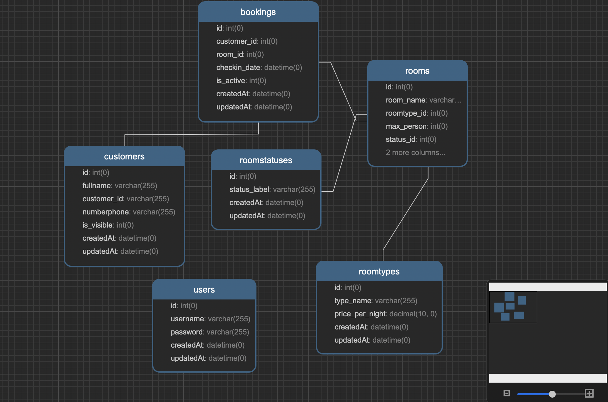

# Hotel Management Application
### Source code bài tập môn CSDL - Lớp CSDL 1920II_INT2207_7

## Thành viên thực hiện 
* Lại Văn Huân - Mã sinh viên: 19020306
* Phạm Hoàng Giang - Mã sinh viên: 19020271

## Các chức năng hiện có

**1. Đăng nhập/ đăng xuất :** Người quản trị có thể đăng nhập và đăng xuất vào hệ thống với tài  
khoản được cung cấp sẵn.

**2. Xem các thông tin cơ bản :** Người quản trị có thể xem các thông tin như danh sách phòng, danh sách  
các người dùng hiện đang đặt phòng, ...

**3. Quản lí:** Người quản trị có thể thao tác thêm, sửa các phòng mới hoặc người dùng vào đặt phòng.

## Các chức năng dự định phát triển tiếp

**1. Thống kê doanh thu**
**2. Tra cứu lịch sử**

## Cơ sở dữ liệu

### Các bảng chính
* **bookings** : lưu trữ các đơn đặt phòng.
* **customers** : lưu trữ thông tin khách hàng.
* **users** : lưu trữ thông tin tài khoản quản trị.
* **rooms** : lưu trữ thông tin các phòng.
* **roomtypes** : lưu trữ thông tin các loại phòng.
* **roomstatuses** : lưu trữ các loại trạng thái của phòng.

## Setup

1. Thay đổi cấu hình thông tin db mysql theo như file config.json.example trong thư mục configs.

2. Cài đặt các package
> npm install

3. Khởi chạy server
> npm start

4. Khởi tạo dữ liệu ban đầu
> node initdb.js

*Lúc này server đã chạy tại cổng 3000, truy cập **htpp://localhost:3000** để xem kết quả.